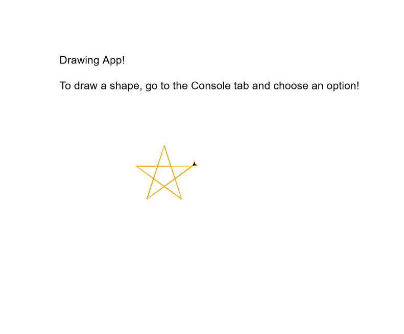

# drawing-app-py
Draw a shape using the Turtle Module in Python!
Select the shape you want drawn, and watch it come to life.

https://repl.it/@vahcooper/110-L7-Hard-Get-Creative-with-the-Turtle-Module-Starter

